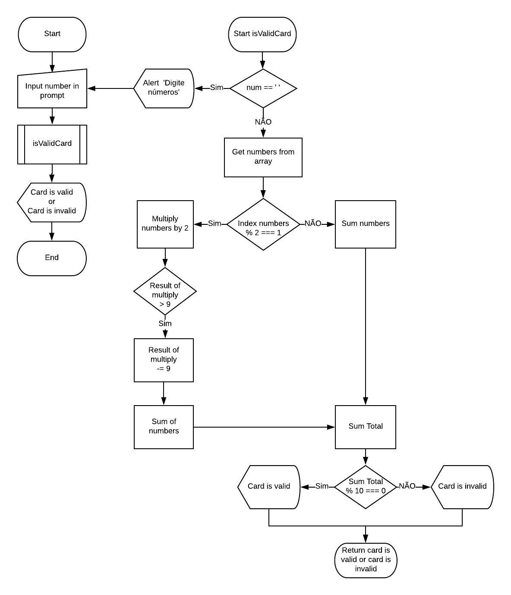

# Validador de Cartão de Crédito

## Motivo
Este é o produto final do Sprint 1 do bootcamp Laboratoria.
O desafio era criar um validador de cartão de crédito usando o algoritmo de Luhn e também descrever todo o processo que se encontra logo abaixo.

## Descrição
1.  O programa inicia pedindo por meio de um **prompt()** que o usuário digite os números do seu cartão e os armazena em uma **variável cardNumber**.
2.  Usando **split()** e **reverse()**, os dados inseridos no prompt() passam a ser **invertidos** e **transformados em uma array**.
3.  A função **isValidCard** inicia, e verifica se o prompt() estiver vazio, retorna um **alert** com a mensagem *'Por favor, insira apenas números'*, se estiver preenchido irá começar a verificação.
4.  Por meio de um **for** é feita uma busca para separar os números com índices **impares** e **pares**.
5.  Se o número tiver índice ímpar, ele será
armazenado em uma **variável multiply2** e **multiplicado por 2**.
6.  Se o número obtido na multiplicação for **maior que 9** será **subtraído 9**.
7.  Os números obtidos após a subtração, serão **somados entre si** e armazenados em uma **variável sumMultiply**.
8.  Os números de índice **pares** que foram separados inicialmente, também serão **somados entre si** e armazenados em uma **variável sum**.
9.  Os valores obtidos na soma dos pares e na soma dos números que foram multiplicados, são **somados** e armazenados em uma **variável sumTotal**.
10. Se o resultado da soma total **dividido por 10 der resto 0**, mostra na tela a mensagem *'Seu cartão é válido'*, se não, mostra na tela a mensagem *'Seu cartão é inválido'* e encerra o programa.

## Fluxograma

